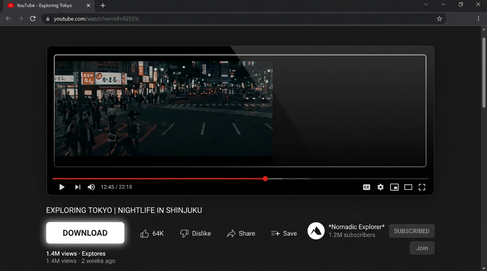
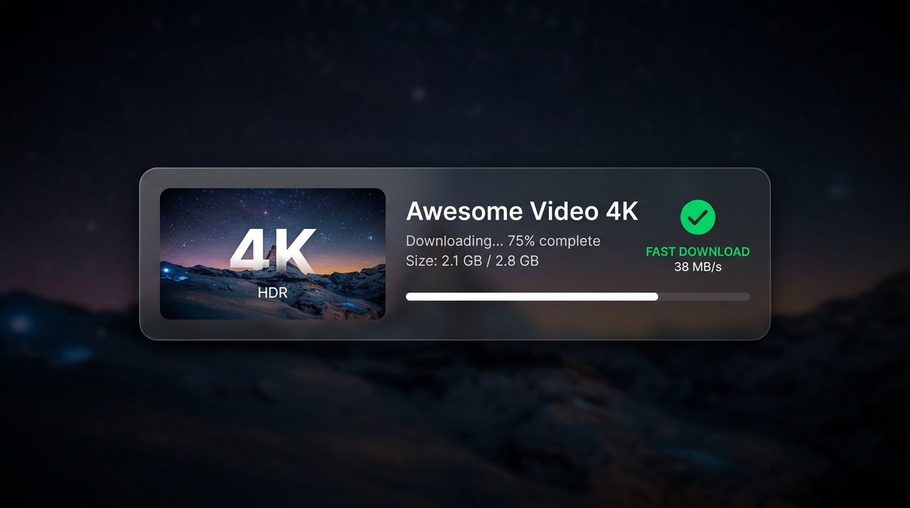

NOTE : All setups, and docs are written by AI. still... it's good. **This Project Will not be maintained further...**

<div align="center">
  
  <h1>👋 Hey there, welcome to YourTube!</h1>
  <p>Clean, fast, and runs entirely on your machine. No servers. No ads. No nonsense.</p>
</div>

I built YourTube because I wanted a completely offline, ad-free, and tracker-free way to download YouTube videos directly from my browser. No shady websites, no slow servers—just a clean, native experience running right on your machine!

YourTube hooks seamlessly into your YouTube player, adding a sleek "Download" button. You just pick your quality, and the reliable `yt-dlp` engine handles the heavy lifting in the background.

<p align="center">
  
  &nbsp;
  
</p>

## 🚀 Let's get it installed!

I've put together an automated installer script that handles literally everything for you. It builds the backend, downloads `yt-dlp` securely, and configures your browsers.

### 1. Setup the Native Client

Just run the one-liner for your OS to download the pre-built client and set up the browser manifests:

**Linux / macOS (Terminal):**
```bash
curl -sSL https://raw.githubusercontent.com/shirushimori/YourTube/main/install.sh | bash
```

**To Uninstall (Linux / macOS):**
```bash
curl -sSL https://raw.githubusercontent.com/shirushimori/YourTube/main/install.sh | bash -s -- --uninstall
```

**Windows (PowerShell):**
```powershell
irm https://raw.githubusercontent.com/shirushimori/YourTube/main/install.ps1 | iex
```

### 2. Install the Extension
Once the setup script finishes, install the YourTube extension into your browser:
- **Firefox:** [Download from Mozilla Add-ons](https://addons.mozilla.org/en-US/firefox/addon/yourtube-a-youtube-addon/)
- **Chrome / Brave / Edge:** Download the latest `yourtube-extension.zip` from the [GitHub Releases](https://github.com/shirushimori/YourTube/releases) page. Extract it, navigate to `chrome://extensions`, enable "Developer Mode", and click "Load unpacked" to select the extracted folder.

## 🎬 How to use it

It's super simple:
1. Go watch a video on YouTube.
2. Notice the sleek new "Download" button right next to the usual actions. Click it!
3. Pick whether you want just audio, video, or both, choose your quality, and hit download.
4. By default, everything saves straight to your OS's default `Videos` folder.

### 🤓 For the Power Users (dosn't works, if you are a developer then you can help me fixx all issues...)

Want to see all your downloads in one place? Just run:
```bash
yourtube-client --tui
```
This opens up a cool Terminal User Interface (TUI) where you can manage your history and monitor active downloads. Enjoy!
